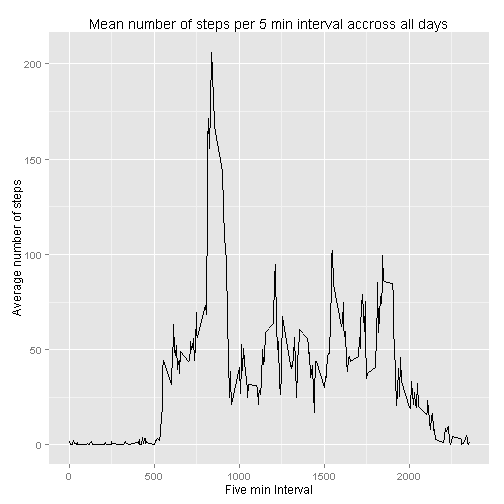

# Reproducible Research: Peer Assessment 1

library(ggplot2)

## Loading and preprocessing the data


```r
library(ggplot2)
setwd("~/1ML/1John Hopkins/Reproducible Research/Exercises")

dat<-read.csv("activity.csv")

dattime<-strptime(dat$date,"%Y-%m-%d")
dat<-cbind(dat,dattime)
```

## What is mean total number of steps taken per day?


```r
dat_agg<-aggregate(dat$steps,list(date=dat$dattime),sum)

names(dat_agg)[2]<-"Number_steps"
p<-ggplot(dat_agg,aes(x=date,y=Number_steps))+geom_bar(stat="identity")
p+ggtitle("Plot of Number of steps per day")
```

```
## Warning: Removed 8 rows containing missing values (position_stack).
```

 

```r
steps_mean<-mean(dat_agg$Number_steps,na.rm=TRUE)
steps_median<-median(dat_agg$Number_steps,na.rm=TRUE)
```

The mean number of steps per day is 1.0766 &times; 10<sup>4</sup>. The median number of step per day is 10765.


## What is the average daily activity pattern?


```r
dat_agg_5min<-aggregate(dat$steps,list(interval=dat$interval),mean,na.rm=TRUE)
names(dat_agg_5min)[2]<-"Avg"
p1<-ggplot(dat_agg_5min,aes(x=interval,y=Avg))+geom_line()
p1<-p1+ggtitle("Mean number of steps per 5 min interval accross all days")
p1+labs(x="Five min Interval",y="Average number of steps")
```

 

```r
# Find the interval corresponding to max  avg. value

p1_max<-dat_agg_5min[dat_agg_5min$Avg==max(dat_agg_5min$Avg),1]
```

The 5 Min interval on average across all the days in the dataset, that contains the maximum number of steps is 835

## Imputing missing values


## Are there differences in activity patterns between weekdays and weekends?


```r
dat$week<-ifelse(weekdays(dat$dattime) %in% c('Saturday','Sunday'), 'weekend','weekday')

dat_agg_week<-aggregate(dat$steps,list(interval=dat$interval,week=dat$week),mean,na.rm=TRUE)
names(dat_agg_week)[3]<-"Avg"
p3<-ggplot(dat_agg_week,aes(x=interval,y=Avg))+geom_line()
p3<-p3+facet_wrap(~week,nrow=2)+ggtitle("Mean number of steps per 5 min interval accross Weekdays and Weekends")
p3+labs(x="Five min Interval",y="Average number of steps")
```

 


